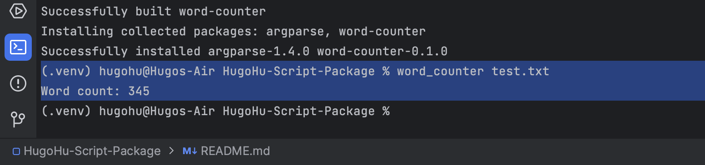
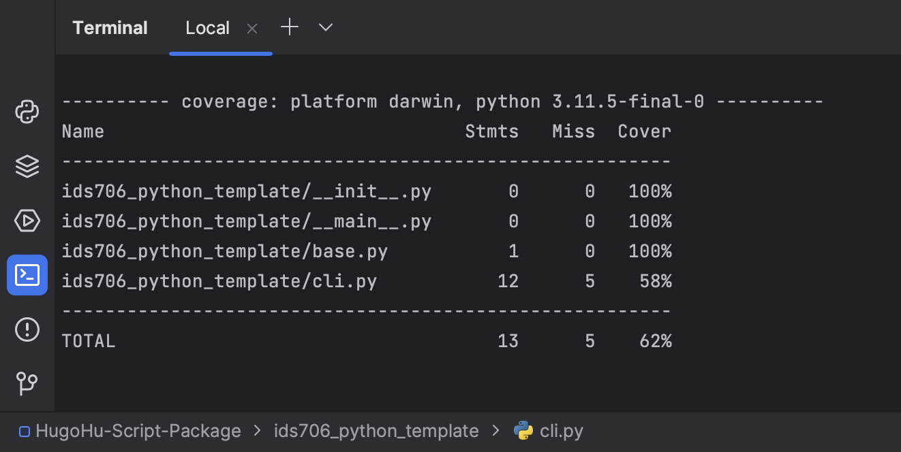

[](https://github.com/nogibjj/HugoHu-Script-Package/actions/workflows/install.yml)

[](https://github.com/nogibjj/HugoHu-Script-Package/actions/workflows/lint.yml)

[](https://github.com/nogibjj/HugoHu-Script-Package/actions/workflows/format.yml)

[](https://github.com/nogibjj/HugoHu-Script-Package/actions/workflows/test.yml)

## Week 6 Mini-project

> © Yadong (Hugo) Hu 2023
> 
> This project was generated by this [Awesome Template](https://github.com/0HugoHu/IDS706-Python-Template)

<br />

**Requirements: Package a Python script into a command-line tool and write a user guide.**


## Project Description
Word Counter Command-Line Tool

This is a simple command-line tool that counts the number of words in a text file.

## Installation

1. Clone the repository or download the source code.
2. Navigate to the project directory.
3. Install the package in editable mode:

```bash
pip install -e .
```

## Usage

To count words in a text file, use the following command:
```bash
word_counter <path_to_text_file>
```

e.g., count the word count in ```test.txt```




## Run

### Some Makefile Commands
```commandline
make clean
make install
make format
make lint
make test
make run
```
### Test Coverage

